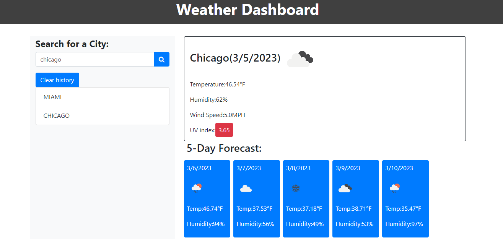

## Server Side API Weather

Server-Side APIs Challenge: Weather Dashboard

- 

## Contents

[Description](#description)

[User Story](#userstory)

[Acceptance Criteria](#acceptancecriteria)

[Application Screenshot Preview](#application-screenshot-preview)

## Description

- Third-party APIs allow developers to access their data and functionality by making requests with specific parameters to a URL.
- Developers are often tasked with retrieving data from another application's API and using it in the context of their own.
  My task is to build a weather dashboard that will run in the browser and feature dynamically updated HTML and CSS.

## User Story

```md
AS A traveler
I WANT to see the weather outlook for multiple cities
SO THAT I can plan a trip accordingly
```

## Acceptance Criteria

```md
GIVEN a weather dashboard with form inputs
WHEN I search for a city
THEN I am presented with current and future conditions for that city and that city is added to the search history
WHEN I view current weather conditions for that city
THEN I am presented with the city name, the date, an icon representation of weather conditions, the temperature, the humidity, and the the wind speed
WHEN I view future weather conditions for that city
THEN I am presented with a 5-day forecast that displays the date, an icon representation of weather conditions, the temperature, the wind speed, and the humidity
WHEN I click on a city in the search history
WHEN I am again presented with current and future conditions for that city
```

## Application Screenshot Preview


